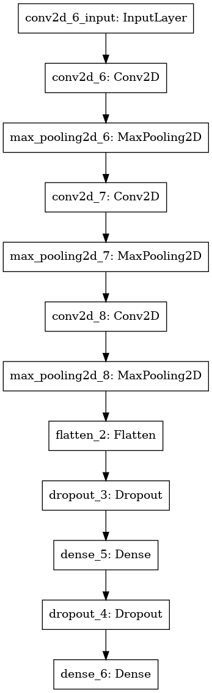

# Captcha Recgnition
 A fast and easy way to recognize captcha image, the cnn-model file only have 5 layers, with an accuracy of 90%.
- **End to end**, all you need is one neural network
- Low delay, **1ms** for one image
- Lite model, **only 5 layers**
- Better accuracy, **90%**
- Easy to use, just two line

</br>

## Model provided
-  Support 4 chars captcha, for example
 - 

-  model structure
 -  

</br>

## Package
- tensorflow2
- numpy 
- Pillow

</br>

## Quick Start
1. install all the package below
2. then
    ```
    import Decaptcha

    # for single image:
    # img_path = './captcha.png'
    y = Decaptcha.dec_batch(img_path)
    print("the value of image {} is {}".format(img_path,y))

    # for batch images:
    # img_src = './sample/'
    Y = DeCaptcha.dec_batch(img_src)
    for y in Y:
        print(y)

    ```
    
## Get Dataset
- Here, I use captcha, a pypi package to generate specific captcha images.
- To get your own dataset, just use the function ```gen_imgs``` from ```DataUtils.py```
```
gen_imgs(src="./sample/", count=40000, width=100, height=60, image_suffix="png")
```

</br>

## About model training
- Custom loss function
    - To get the model better and more quickly fit the captcha data, I have customed the CE loss function,as follow:
        ```
        def captcha_loss(y,pred):
            y_pred = tf.reshape(pred, [-1, max_chars, len(char_set)]) 
            y_true = tf.reshape(y, [-1, max_chars, len(char_set)]) 
            loss = tf.keras.losses.binary_crossentropy(y_true,y_pred,label_smoothing=0.1)   #(BATCH_SIZE, max_chars,)
            loss = tf.reduce_sum(loss,axis=1)      #(BATCH_SIZE,)
            loss = tf.reduce_mean(loss)        #()
            return  loss
        ```
    
</br>

- Label smoothing
    - set 0.075~0.25. a trick which advances the valid_acc 10 more points.

</br>

- valid accuracy plot
    - 

</br>

## Development
- First version, 2020.6.27
